http://slides/cryptoparty-hamburg.de/master/  
Download: http://cryptoparty-hamburg.de/download  

 
Bitte keine Fotos machen.

# Cryptoparty  Hamburg

## Inhalt und Ablauf
* Einleitung
* Das Internet
* Passwörter
* <b>Mailverschlüsselung</b>
* <b>Festplattenverschlüsselung</b>
* <b>Chatverschlüsselung</b>
* Über Smartphones und Tablets
* Fragen und Antworten

# Einleitung
> “Man is least himself when he talks in his own person. Give him a mask, and he will tell you the truth.” - Oscar Wilde

### Einführung in die Anwendung von verschlüsselter Software

### Was wir heute lernen hilft **nicht** dagegen, dass jeder weiß wann man mit wem kommuniziert (Metadaten)

### Kriterien für Verschlüsselungssoftware

* Vertraulichkeit Nur die Empfänger können die Nachricht lesen
* Beglaubigung Die Empfänger können sicherstellen, dass die Nachricht wirklich vom Sender kommt
* Abstreitbarkeit Nach der Konversation ist die Beglaubigung nichtig
* Folgenlosigkeit Wenn einem der Gesprächspartner der Schlüssel verloren geht, hat dies keine Konsequenzen für die bereits verschlüsselt geführten Konversationen

### 100% Sicherheit gibt es nicht

### Es fehlt Software, Benutzbarkeit ist mangelhaft

### Es fehlt die Unterstützung durch die großen Unternehmen

# Das Internet

## Wie funktioniert das Ganze?

# Passwörter

## Nur ein langes Passwort ist ein gutes Passwort

A-Z + a-z (52 Zeichen) 
6 Zeichen: 20 Sekunden 
10 Zeichen: 5 Jahre

A-Z + a-z + Sonderzeichen  (96 Zeichen) 
6 Zeichen: 13 Minuten 
10 Zeichen: 2108 Jahre

* 1Password (Mac)
* Keepass (Mac, Win, Linux)
* OS X Schlüsselbund (Mac)
* Seahorse (Linux)
* USB-Sticks 

# E-Mail-
# verschlüsselung

## Einführung in Crypto-Verfahren

## Privater Schlüssel vs. öffentlicher Schlüssel

## Thunderbird + Enigmail
Bitte installieren 
* http://www.mozilla.org/de/thunderbird/
* https://addons.mozilla.org/de/thunderbird/addon/enigmail/
* Windows: http://files.gpg4win.org/gpg4win-vanilla-2.1.1.exe 
* Mac: https://gpgtools.org/

## bietet
* Vertraulichkeit
* Beglaubigung

## bietet nicht
* Abstreitbarkeit
* Folgenlosigkeit

## Generieren von Schlüsseln
 OpenPGP > Schlüssel verwalten ...   Erzeugen > Neues Schlüsselpaar ...

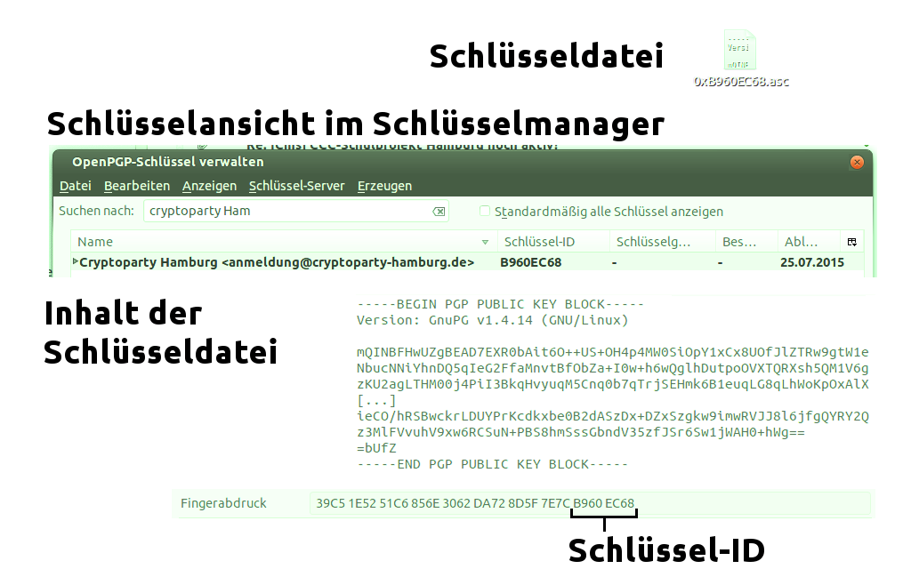

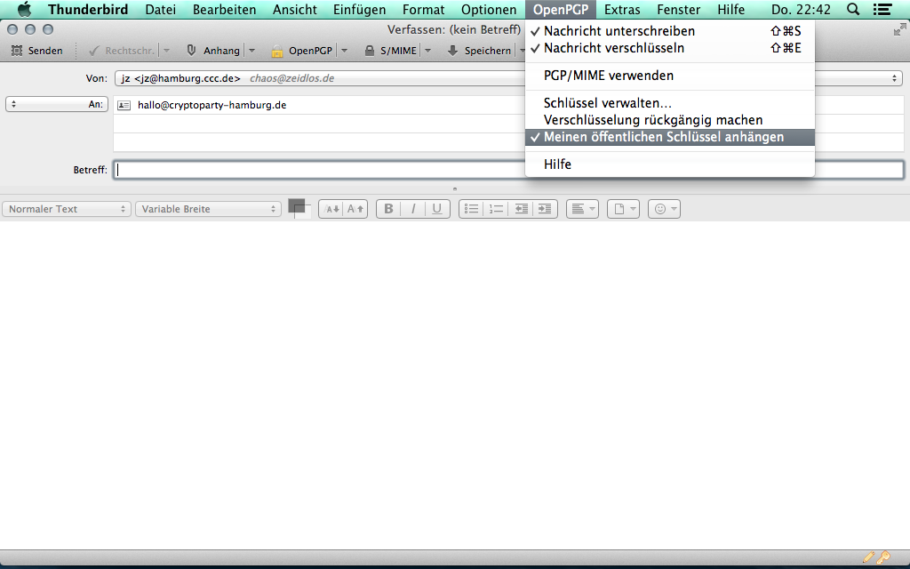

## Web-Of-Trust

## Key-Signing/Trust-Level

# Verschlüsselte
# Container

## TrueCrypt
### Windows, Mac, Linux

## FileVault
### Mac

## Encfs
### Mac, Linux

### Kann auch nachträglich
### Verzeichnisse verschlüsseln.

Kann man z.B. Cryptkeeper oder Gnome Encfs Manager installieren

# Festplatten-
# verschlüsselung

## TrueCrypt
### Windows

### Benötigt einen CD-Brenner für Rescue-CD!

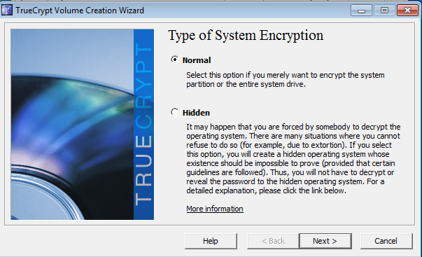

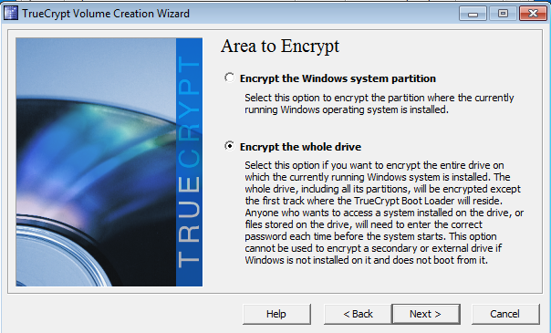

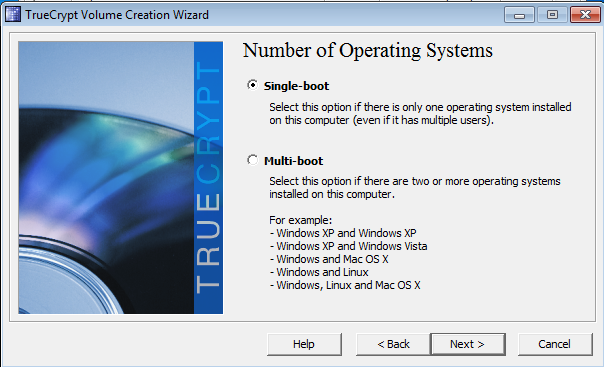

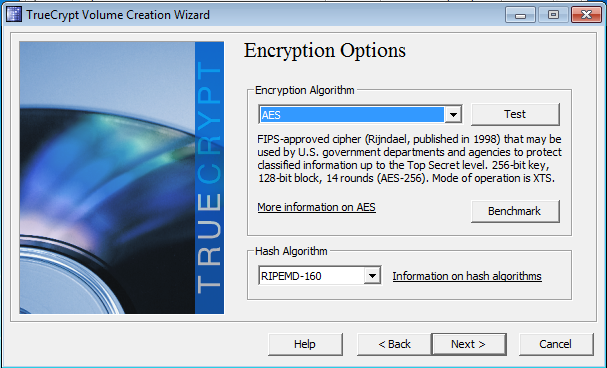

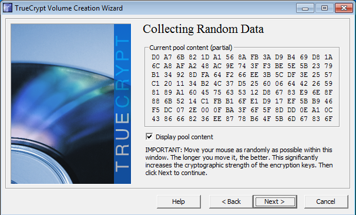

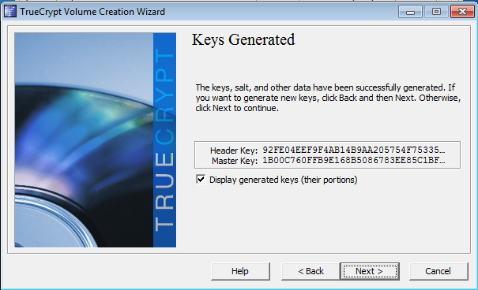

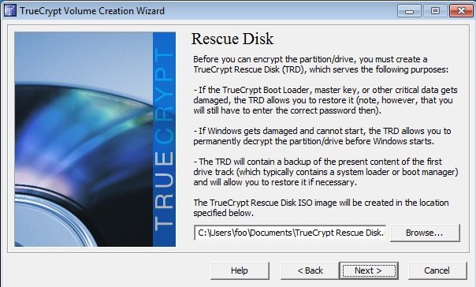

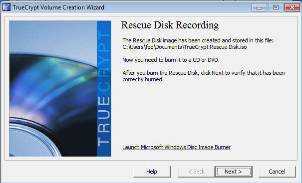

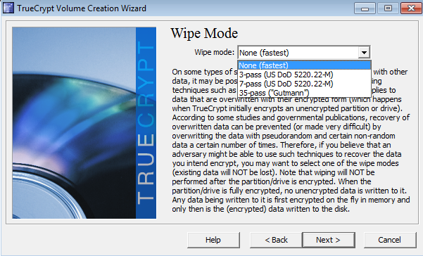

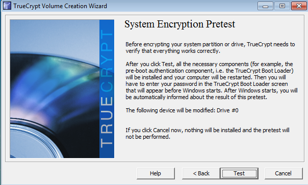

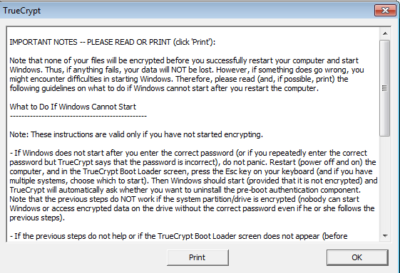

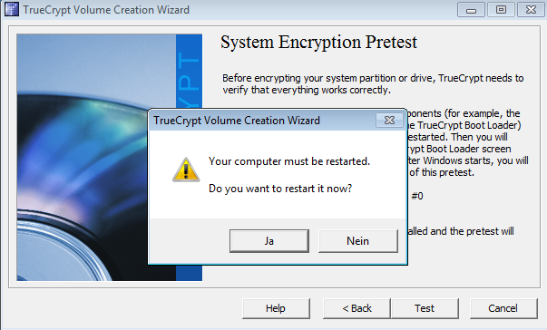

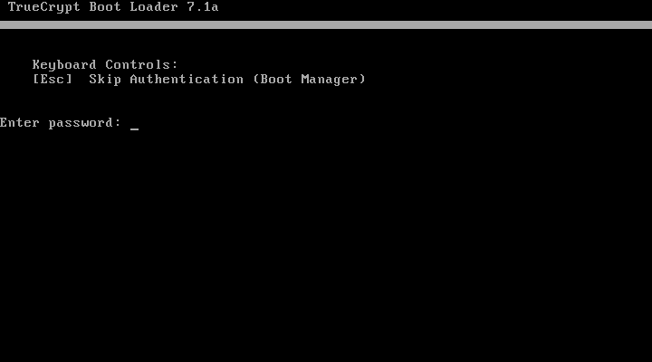

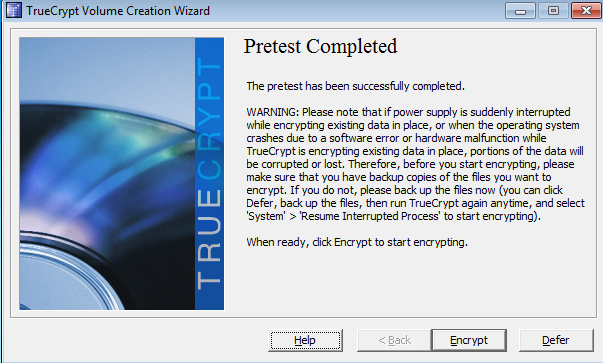

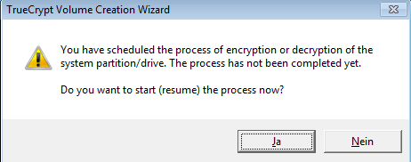

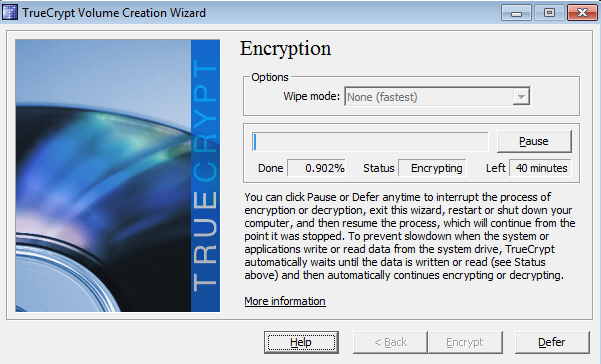

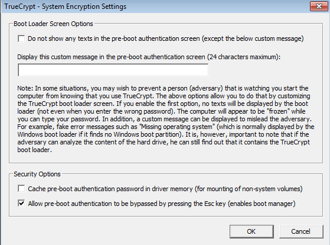

## FileVault
### Mac

## BitLocker
### Windows

### USB-Stick wird nur bei alten PCs gebraucht (ohne TPM)
### Sonst kann man hier eine PIN eingeben

### Eventuell nötige Einstellung bei älteren PCs (ohne TPM)

### Eventuell nötige Einstellung bei älteren PCs (ohne TPM)

## DM-Crypt
### Linux

### Muss bei der Installation eingeschaltet werden.

# Chat-
# verschlüsselung

## XMPP mit OTR
* Pidgin (Windows, Linux)
* Adium (Mac)

## bietet
* Vertraulichkeit
* Beglaubigung
* Abstreitbarkeit
* Folgenlosigkeit

## Verschlüsselt über Facebook chatten

## Und jetzt ihr!
* http://adium.im/  (Mac)
* http://www.pidgin.im/  (Windows/Linux)
  * http://www.cypherpunks.ca/otr/  (OTR Plugin für Pidgin)
* jabber.hamburg.ccc.de
* jabber.itpunks.net
* jabber.chaos.li
* jabber.gabbler.net

# Über Smartphones und Tablets

## Geräte sind unsicher

## OTR ist in Ordnung

## PGP/GPG würden wir nicht machen

## Siehe Links am Ende um sich selbst einzuarbeiten

# Links
* https://prism-break.org/
* https://slides.cryptoparty-hamburg.de/master/
* https://cybererrorism.noblogs.org/files/2013/06/privacy-handbuch.pdf
* http://mirror-de.cryptoparty.is/handbook/
* https://cryptoparty.in (Englisch)

Diese Cryptoparty wurde von der Wau-Holland-Stiftung finanziell unterstützt.
Spenden sind gern gesehen. 
http://www.wauland.de/

# Danke!
http://cryptoparty-hamburg.de/ 
http://hamburg.ccc.de/  
hallo@cryptoparty-hamburg.de/ 
Fingerprint: 39C5 1E52 51C6 856E 3062 DA72 8D5F 7E7C B960 EC68
