# Cryptoparty  Hamburg

## Inhalt und Ablauf
* Einleitung
* Das Internet
* Passwörter
* Festplattenverschlüsselung
* Chatverschlüsselung
* Mailverschlüsselung
* Über Smartphones und Tablets
* Fragen und Antworten

# Einleitung
> “Man is least himself when he talks in his own person. Give him a mask, and he will tell you the truth.” - Oscar Wilde

### Einführung in die Nutzung kryptographischer Software
* Es gibt keine Silver Bullets!
* Was wir heute lernen hilft **nicht** gegen die Preisgabe von Verbindungsdaten (aka Metadaten)
* Krypto kann nur in sicheren Umgebungen funktionieren
* Krypto kann nur das, wofür es gedacht ist
* Nichts für Krypto benutzen, was nicht für Krypto gedacht ist
* Es fehlt Software, es fehlt Usability
* Es fehlt der Support der Closed Source OSS-Vendor (siehe z.B. GPGMail)

# Das Internet

## Wie funktioniert das Ganze?

# Passwörter

## Nur ein langes Passwort ist ein gutes Passwort

* 1Password
* Keepass
* OS X Schlüsselbund
* Seahorse
* USB-Sticks

# Festplatten-
# verschlüsselung

## TrueCrypt
### Windows, Mac, Linux

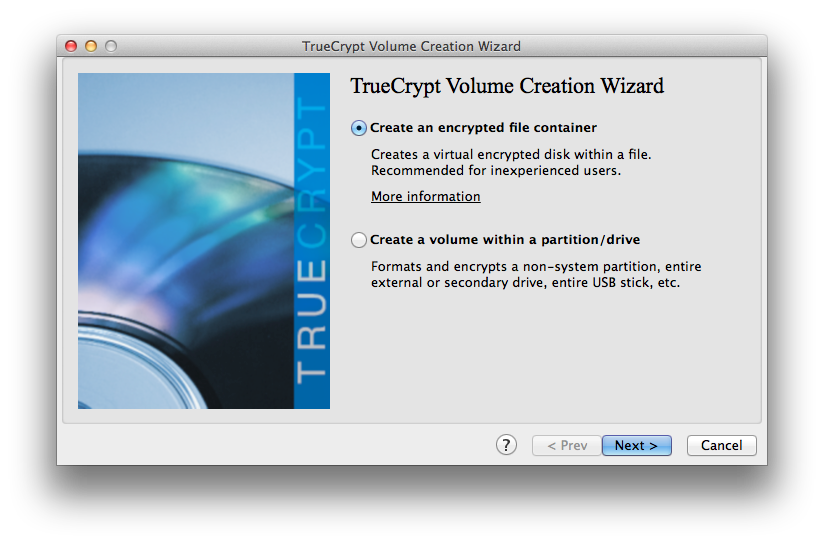

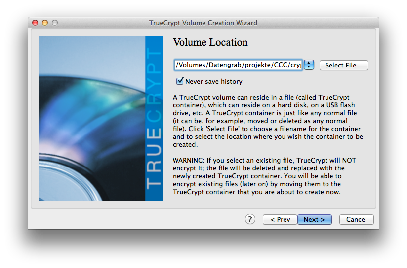

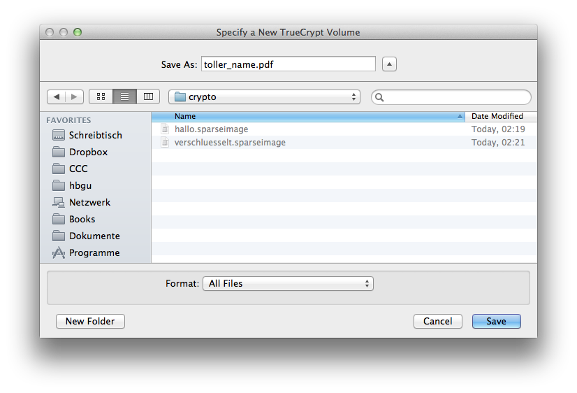

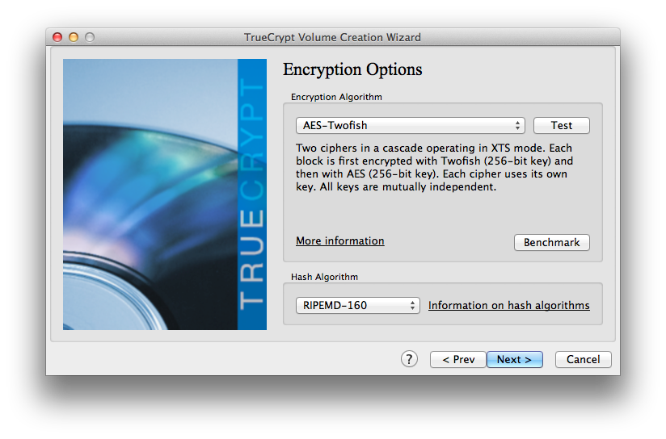

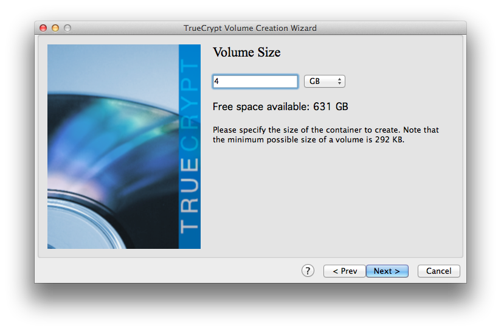

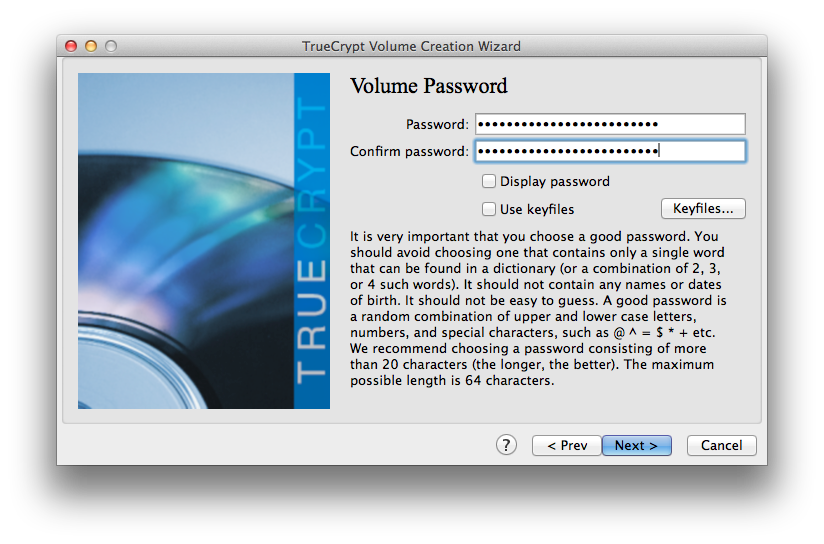

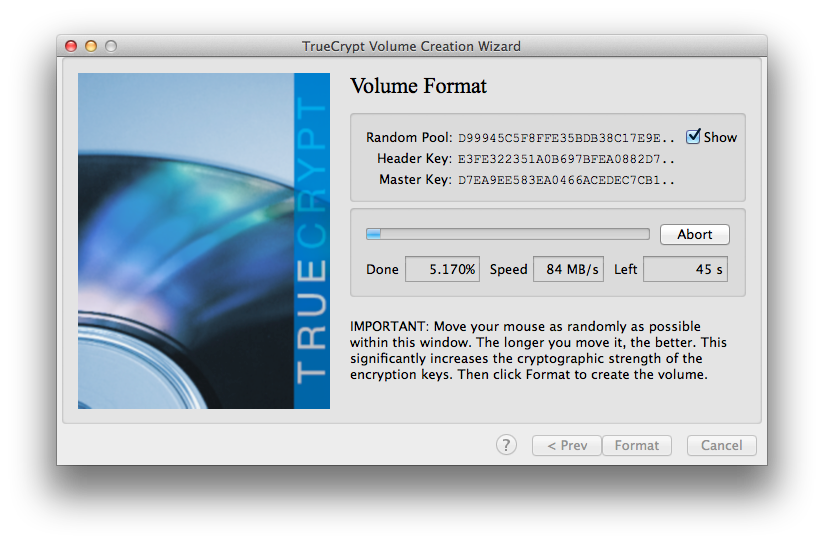

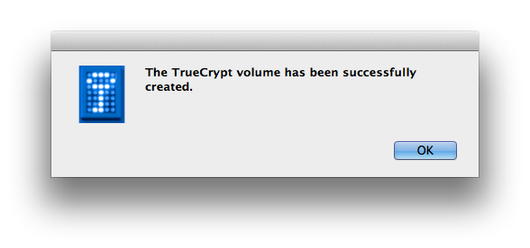

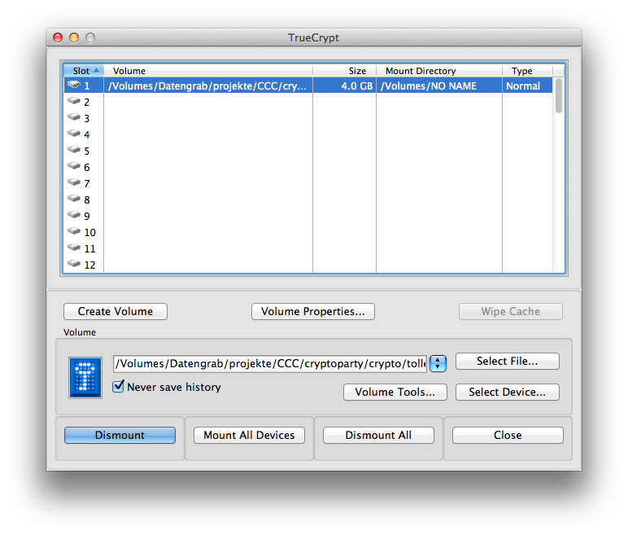

## FileVault (Mac)

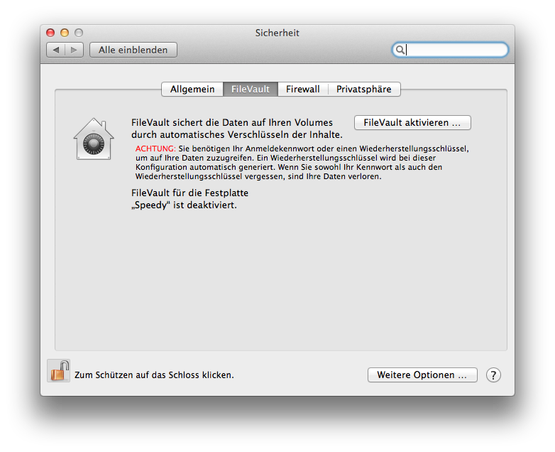

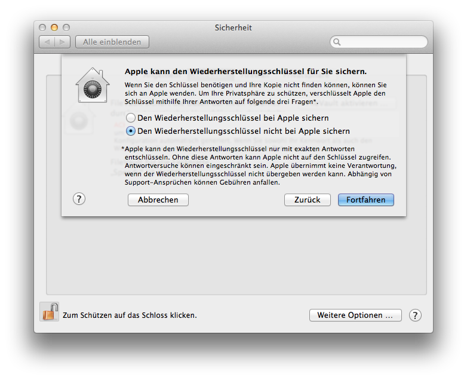

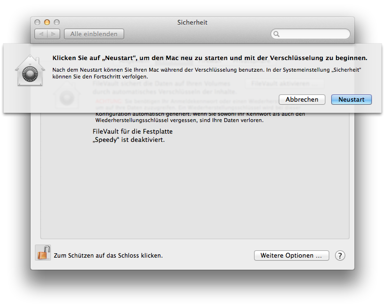

## Verschlüsselte Container (Mac)

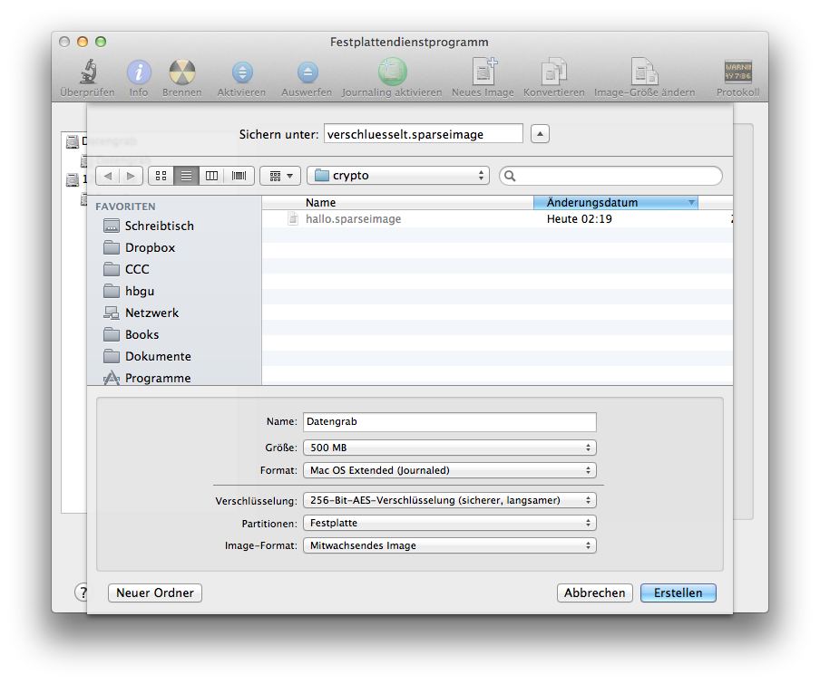

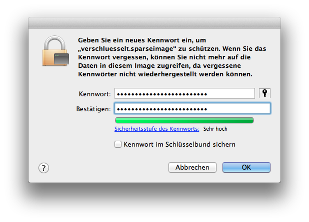

## DM-Crypt (Linux)

### Muss bei der Installation eingeschaltet werden.

## Encfs (Linux/Mac)

### Kann auch nachträglich Verzeichnisse verschlüsseln.

# Chat-
# verschlüsselung

## XMPP mit OTR
* Pidgin (Windows, Linux)
* Adium (Mac)

## Verschlüsselt über Facebook chatten

## Und jetzt ihr!
* jabber.ccc.de

* http://adium.im/
* http://www.pidgin.im/
  * http://www.cypherpunks.ca/otr/

# E-Mail-
# verschlüsselung

## Einführung in Crypto-Verfahren

## Privater Schlüssel vs. öffentlicher Schlüssel

## Thunderbird + Enigmail
Bitte installieren

## Generieren von Schlüsseln
 OpenPGP > Schlüssel verwalten ...   Erzeugen > Neues Schlüsselpaar ...

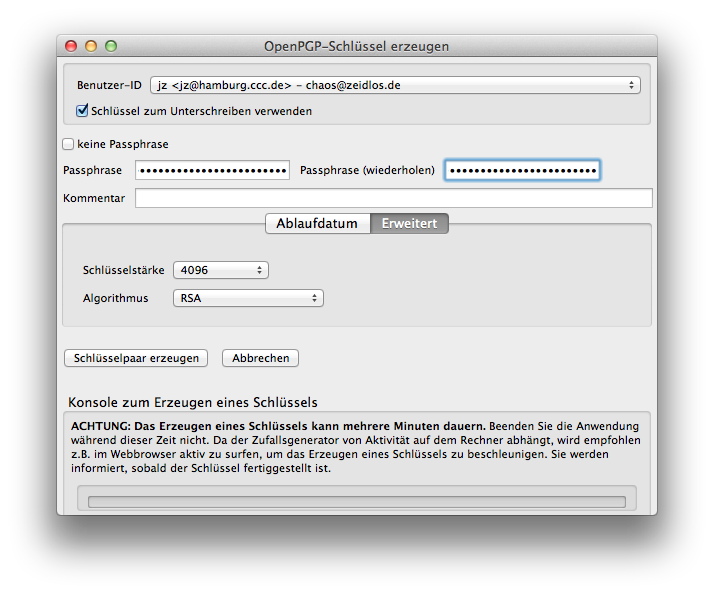

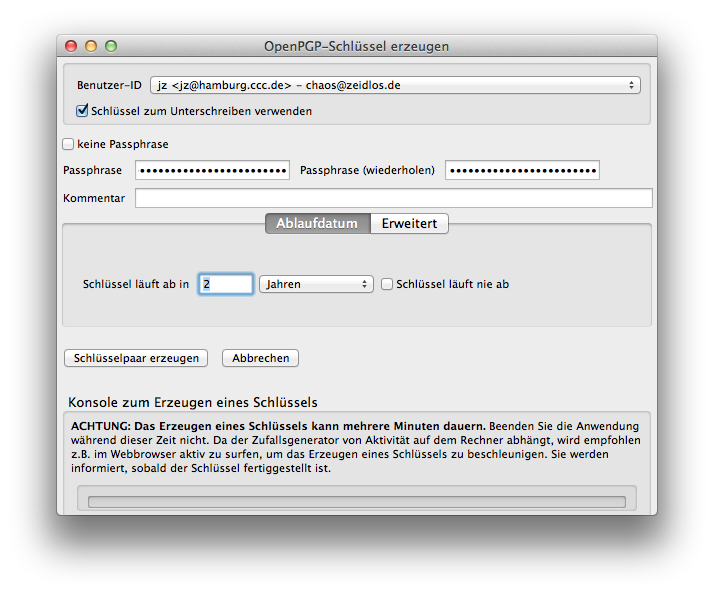

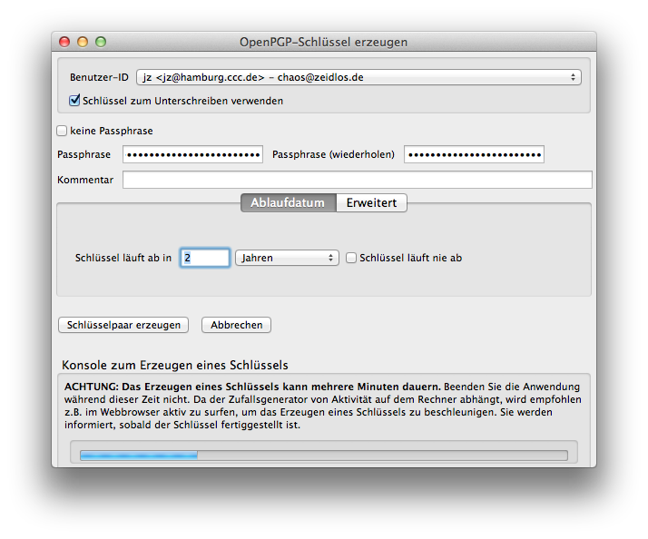

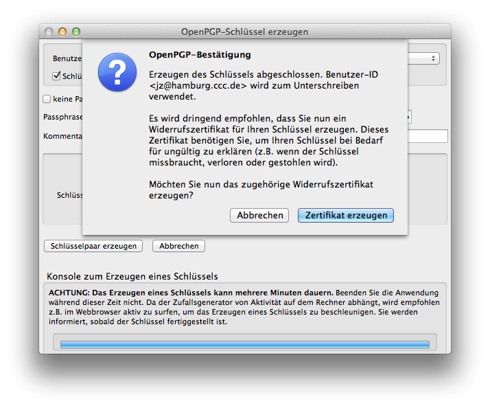

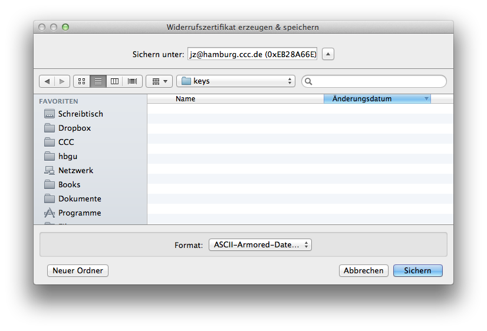

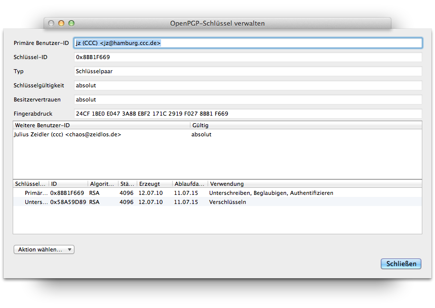

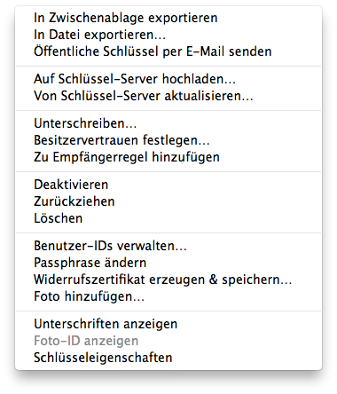

## Web-Of-Trust

## Key-Signing/Trust-Level

# Über Smartphones und Tablets

## Geräte sind unsicher

## OTR ist in Ordnung

## PGP/GPG würden wir nicht machen

# Danke!
http://cryptoparty-hamburg.de 
http://hamburg.ccc.de 
hallo@cryptoparty-hamburg.de 
Fingerprint: 39C5 1E52 51C6 856E 3062 DA72 8D5F 7E7C B960 EC68

# Fragen und Antworten

# Links
Cryptoparty-Handbuch
Privacy-Handbuch