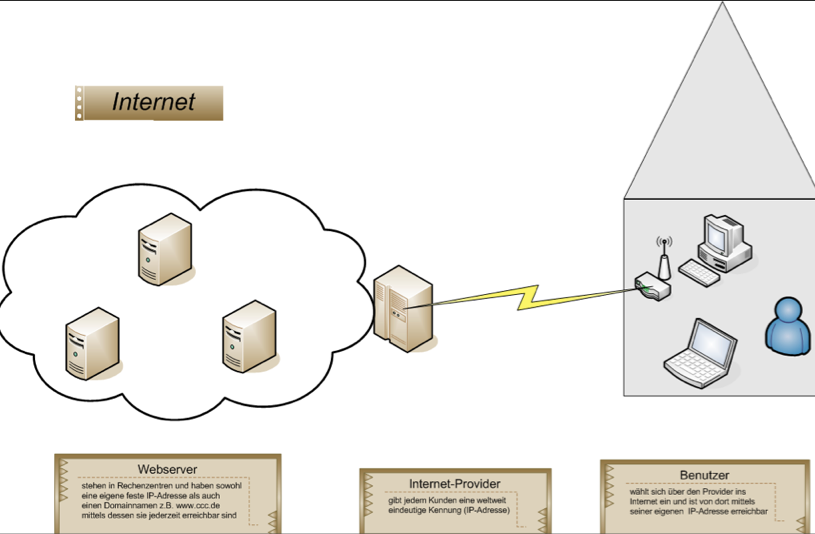
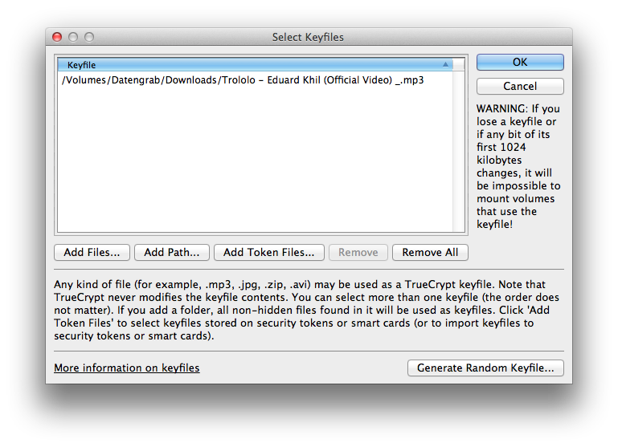

http://cryptoparty-hamburg.de/slides/  
Download: http://cryptoparty-hamburg.de/download  

WLAN: xxxxxxxx 
Passwort: xxxxxxxx

# Cryptoparty  Hamburg

## Inhalt und Ablauf
* Einleitung
* Das Internet
* Passwörter
* Festplattenverschlüsselung
* Chatverschlüsselung
* Mailverschlüsselung
* Über Smartphones und Tablets
* Fragen und Antworten

# Einleitung
> “Man is least himself when he talks in his own person. Give him a mask, and he will tell you the truth.” - Oscar Wilde

### Einführung in die Nutzung kryptographischer Software

### Es gibt keine Silver Bullets!

### Was wir heute lernen hilft **nicht** gegen die Preisgabe von Verbindungsdaten (aka Metadaten)

### Krypto kann nur in sicheren Umgebungen funktionieren

### Krypto kann nur das, wofür es gedacht ist

* Vertraulichkeit Nur die Empfänger können die Nachricht lesen
* Beglaubigung Die Empfänger können sicherstellen, dass die Nachricht wirklich vom Sender kommt
* Abstreitbarkeit Nach der Konversation ist die Beglaubigung nichtig
* Folgenlosigkeit Wenn einem der Gesprächspartner der Schlüssel verloren geht, hat dies keine Konsequenzen für die bereits verschlüsselt geführten Konversationen

### Es fehlt Software, es fehlt Usability

### Es fehlt der Support der Closed Source OSS-Vendor (siehe z.B. GPGMail)

# Das Internet

## Wie funktioniert das Ganze?

# Passwörter

## Nur ein langes Passwort ist ein gutes Passwort

A-Z + a-z (52 Zeichen) 
6 Zeichen: 20 Sekunden 
10 Zeichen: 5 Jahre

A-Z + a-z + Sonderzeichen  (96 Zeichen) 
6 Zeichen: 13 Minuten 
10 Zeichen: 2108 Jahre

* 1Password
* Keepass
* OS X Schlüsselbund
* Seahorse
* USB-Sticks

# Festplatten-
# verschlüsselung

## TrueCrypt
### Windows, Mac, Linux

## FileVault (Mac)

## Verschlüsselte Container (Mac)

## DM-Crypt (Linux)

### Muss bei der Installation eingeschaltet werden.

## Encfs (Linux/Mac)

### Kann auch nachträglich Verzeichnisse verschlüsseln.

Kann man z.B. Cryptkeeper oder Gnome Encfs Manager installieren

# Chat-
# verschlüsselung

## XMPP mit OTR
* Pidgin (Windows, Linux)
* Adium (Mac)

## bietet
* Vertraulichkeit
* Beglaubigung
* Abstreitbarkeit
* Folgenlosigkeit

## Verschlüsselt über Facebook chatten

## Und jetzt ihr!
* http://adium.im/  (Mac)
* http://www.pidgin.im/  (Windows/Linux)
  * http://www.cypherpunks.ca/otr/  (OTR Plugin für Pidgin)
* jabber.hamburg.ccc.de  (Account im Programm registrieren)  
* WLAN: xxxxxx
* Passwort: xxxxxx

# Pause
### weiter geht es in 30 Minuten

# E-Mail-
# verschlüsselung

## Einführung in Crypto-Verfahren

## Privater Schlüssel vs. öffentlicher Schlüssel

## Thunderbird + Enigmail
Bitte installieren 
* http://www.mozilla.org/de/thunderbird/
* https://addons.mozilla.org/de/thunderbird/addon/enigmail/
* Windows: http://files.gpg4win.org/gpg4win-vanilla-2.1.1.exe 
* Mac: https://gpgtools.org/

## bietet
* Vertraulichkeit
* Beglaubigung

## bietet nicht
* Abstreitbarkeit
* Folgenlosigkeit

## Generieren von Schlüsseln
 OpenPGP > Schlüssel verwalten ...   Erzeugen > Neues Schlüsselpaar ...

## Web-Of-Trust

## Key-Signing/Trust-Level

# Über Smartphones und Tablets

## Geräte sind unsicher

## OTR ist in Ordnung

## PGP/GPG würden wir nicht machen

# 30. Chaos Communication Congress

### ~6000 Besucher
### 27. bis 30.12.
### Tickets an der Abendkasse erhältlich (15€/Tag, 80€/4 Tage)
### https://events.ccc.de/

## 26c3 Impressionen
## http://www.youtube.com/watch?v=tQzfiiwPh9E

# Links
* http://cryptoparty-hamburg.de/slides/
* http://cybererrorism.noblogs.org/files/2013/06/privacy-handbuch.pdf
* http://mirror-de.cryptoparty.is/handbook/
* http://cryptoparty.in (Englisch)

Diese Cryptoparty wurde von der Wau-Holland-Stiftung finanziell unterstützt.
Spenden sind gern gesehen.

# Danke!
http://cryptoparty-hamburg.de 
http://hamburg.ccc.de  
hallo@cryptoparty-hamburg.de 
Fingerprint: 39C5 1E52 51C6 856E 3062 DA72 8D5F 7E7C B960 EC68
